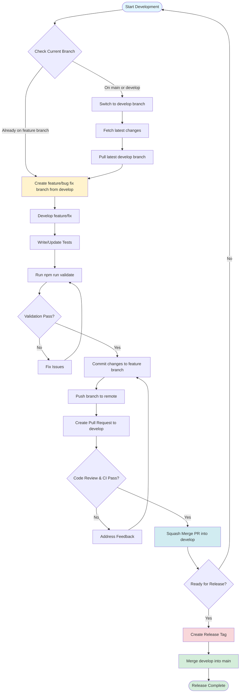

# Development Guide

This guide provides step-by-step instructions for adding new features and creating new modules following the architecture patterns.

## Table of Contents

1. [Git Workflow](#git-workflow)
2. [Adding a New Feature](#adding-a-new-feature)
3. [Creating a New Module](#creating-a-new-module)
4. [Common Patterns](#common-patterns)
5. [Testing Guidelines](#testing-guidelines)

## Git Workflow

This section describes the Git workflow for feature development and releases.

### Development Workflow

The following flowchart illustrates the complete Git workflow from feature development to release:



### Workflow Steps

1. **Create Feature/Bug Fix Branch from Develop**
   - Ensure you're on the `develop` branch: `git checkout develop`
   - Fetch latest changes: `git fetch origin`
   - Pull latest changes: `git pull origin develop`
   - Create a new branch: `git checkout -b feature/your-feature-name` or `git checkout -b fix/your-bug-fix-name`
   - Use descriptive branch names in kebab-case (e.g., `feature/add-user-authentication`, `fix/pagination-bug`)

2. **Push Code and Create Pull Request**
   - Make your code changes
   - Write/update tests to maintain 100% coverage
   - Run validation: `npm run validate` (must pass before committing)
   - Commit changes: `git add . && git commit -m "Descriptive commit message"`
   - Push branch to remote: `git push -u origin feature/your-feature-name`
   - Create a Pull Request targeting the `develop` branch
   - Wait for code review and CI checks to pass

3. **Merge to Develop (Squash Merge)**
   - Once code review is approved and all CI checks pass
   - Merge the PR using **Squash Merge** strategy
   - This creates a single commit on `develop` with all changes from the feature branch
   - The feature branch can be deleted after merging

4. **Create Release Tag and Merge to Main**
   - When ready for a release:
     - Create a release tag on `develop`: `git tag -a v1.0.0 -m "Release version 1.0.0"`
     - Push the tag: `git push origin v1.0.0`
   - Merge `develop` into `main`:
     - Switch to main: `git checkout main`
     - Pull latest: `git pull origin main`
     - Merge develop: `git merge develop`
     - Push to remote: `git push origin main`

### Branch Naming Conventions

- **Feature branches**: `feature/description-of-feature` (e.g., `feature/add-user-authentication`)
- **Bug fix branches**: `fix/description-of-bug` (e.g., `fix/pagination-validation-error`)
- **Hotfix branches**: `hotfix/description-of-hotfix` (e.g., `hotfix/security-patch`)

### Important Notes

- **Never commit directly to `main` or `develop` branches** - always use feature branches
- **Always run `npm run validate` before committing** - this ensures code quality, formatting, and test coverage
- **Use squash merge** when merging PRs to `develop` - this keeps the commit history clean
- **Create release tags** on `develop` before merging to `main` - this marks specific release points
- **Merge `develop` into `main`** only when ready for production release

## Adding a New Feature

This walkthrough shows how to add a new feature to an existing module. We'll use "Update User Profile" as an example.

### Step 1: Domain Layer - Update Aggregate (if needed)

If the aggregate already exists and has the necessary methods, skip to Step 2. Otherwise, add methods to the aggregate:

```typescript
// modules/auth/domain/aggregates/user.ts
export class User extends BaseAggregate {
  // ... existing code ...

  setDisplayName(displayName: string | undefined): void {
    this._displayName = User.validateDisplayName(displayName);
  }

  setUsername(username: Username | undefined): void {
    this._username = username;
  }
}
```

### Step 2: Application Layer - Create Command Interface

Define the command interface:

```typescript
// modules/auth/application/interfaces/commands/update-profile.command.ts
import type { Command } from '@app/common/interfaces/command';

export interface UpdateProfileCommand extends Command {
  readonly displayName?: string;
  readonly username?: string;
}
```

### Step 3: Application Layer - Create Command Handler

Create a command handler for the update operation:

```typescript
// modules/auth/application/command-handlers/update-profile.command-handler.ts
import { AuthorizationService } from '@app/common/application/services/authorization.service';
import type { EventDispatcher } from '@app/common/domain/interfaces/event-dispatcher';
import { Uuid } from '@app/common/domain/value-objects/uuid';
import type { CommandHandler } from '@app/common/interfaces/command';
import type { AppContext } from '@app/common/interfaces/context';
import { sanitize } from '@app/common/utils/sanitize';
import { validate } from '@app/common/utils/validate';
import type { UpdateProfileCommand } from '@app/modules/auth/application/interfaces/commands/update-profile.command';
import { User } from '@app/modules/auth/domain/aggregates/user';
import { AuthExceptionCode } from '@app/modules/auth/domain/enums/auth-exception-code';
import type { UserRepository } from '@app/modules/auth/domain/interfaces/repositories/user.repository';
import { Username } from '@app/modules/auth/domain/value-objects/username';

export class UpdateProfileCommandHandler
  implements CommandHandler<UpdateProfileCommand, void>
{
  constructor(
    private readonly userRepository: UserRepository,
    private readonly authorizationService: AuthorizationService,
    private readonly eventDispatcher: EventDispatcher
  ) {}

  async execute(
    command: UpdateProfileCommand,
    context?: AppContext
  ): Promise<void> {
    // 1. Authorization
    this.authorizationService.requireAuthenticated(context);

    // 2. Local validations first
    const displayName = command.displayName
      ? User.validateDisplayName(sanitize(command.displayName))
      : undefined;
    const username = command.username
      ? Username.create(sanitize(command.username))
      : undefined;

    // 3. Check if there are updates
    const hasUpdates = displayName !== undefined || username !== undefined;
    if (!hasUpdates) {
      return; // Early return - no database query needed
    }

    // 4. Load aggregate
    const userId = Uuid.create(context!.user!.userId);
    const user = await this.userRepository.findById(userId);
    if (!user) {
      throw new ValidationException(AuthExceptionCode.USER_NOT_FOUND);
    }

    // 5. Prepare update (validates version and increments it internally)
    user.prepareUpdate(userId);

    // 6. Apply changes
    if (displayName !== undefined) {
      user.setDisplayName(displayName);
    }
    if (username !== undefined) {
      // Check uniqueness
      const usernameExists = await this.userRepository.usernameExists(
        username,
        userId
      );
      validate(!usernameExists, AuthExceptionCode.USERNAME_ALREADY_TAKEN);
      user.setUsername(username);
    }

    // 7. Save aggregate (persists events to database)
    await this.userRepository.save(user);

    // 8. Dispatch events asynchronously
    await this.eventDispatcher.dispatch(user.getEvents());
  }
}
```

### Step 4: Adapters Layer - Create REST Route

Add a REST API route handler:

```typescript
// modules/auth/adapters/routes/auth.route.ts
const userProfileResponseSchema = {
  type: 'object',
  properties: {
    id: { type: 'string' },
    email: { type: 'string' },
    signInType: {
      type: 'string',
      enum: ['EMAIL', 'GOOGLE', 'APPLE'],
    },
    externalId: { type: 'string' },
    displayName: { type: 'string', nullable: true },
    username: { type: 'string', nullable: true },
    version: { type: 'number' },
    createdAt: { type: 'string', format: 'date-time' },
  },
} as const;

function register(app: FastifyInstance): void {
  const { diContainer } = app;
  const updateProfileCommandHandler =
    diContainer.resolve<UpdateProfileCommandHandler>(
      'updateProfileCommandHandler'
    );
  const getProfileQueryHandler = diContainer.resolve<GetProfileQueryHandler>(
    'getProfileQueryHandler'
  );

  app.put(
    '/auth/me',
    {
      schema: {
        summary: 'Update current user profile',
        tags: ['auth'],
        security: [{ bearerAuth: [] }],
        body: {
          type: 'object',
          properties: {
            displayName: { type: 'string' },
            username: { type: 'string' },
          },
        },
        response: {
          200: userProfileResponseSchema,
          ...includeRouteSchemas([400, 401, 409, 500]),
        },
      },
    },
    async (request, reply) => {
      await updateProfileCommandHandler.execute(
        request.body as UpdateProfileCommand,
        request.appContext
      );

      // Return updated profile
      const result = await getProfileQueryHandler.execute(
        {},
        request.appContext
      );
      await reply.code(200).send(result);
    }
  );
}
```

### Step 5: Adapters Layer - Create GraphQL Schema

Create a GraphQL schema to expose the feature via GraphQL:

```typescript
// modules/auth/adapters/graphql/auth.schema.ts
export const authSchema = `
  input UpdateUserInput {
    displayName: String
    username: String
  }

  type UserProfile {
    id: ID!
    email: String!
    displayName: String
    username: String
    version: Int!
    createdAt: String!
  }

  type AuthMutation {
    updateProfile(input: UpdateUserInput!): UserProfile!
  }

  extend type Mutation {
    auth: AuthMutation!
  }
`;
```

**Note**: GraphQL schemas are automatically discovered and registered, similar to REST routes. Schema files must follow the naming convention `*.schema.ts` and export a schema string ending with `Schema` (e.g., `authSchema`). GraphQL is enabled by default and uses GraphQL SDL (Schema Definition Language) format.

### Step 6: Adapters Layer - Create GraphQL Resolvers

Create GraphQL resolvers that resolve handlers directly from the DI container:

```typescript
// modules/auth/adapters/graphql/auth.resolvers.ts
import type { MercuriusContext } from 'mercurius';
import { UpdateProfileCommandHandler } from '@app/modules/auth/application/command-handlers/update-profile.command-handler';
import type { UpdateProfileCommand } from '@app/modules/auth/application/interfaces/commands/update-profile.command';
import { GetProfileQueryHandler } from '@app/modules/auth/application/query-handlers/get-profile.query-handler';

import '@app/application/graphql/context';

export const authResolvers = {
  Mutation: {
    auth: () => ({}),
  },
  AuthMutation: {
    updateProfile: async (
      _parent: unknown,
      args: { input: UpdateProfileCommand },
      context: MercuriusContext
    ) => {
      const updateProfileCommandHandler =
        context.request.server.diContainer.resolve<UpdateProfileCommandHandler>(
          'updateProfileCommandHandler'
        );
      const getProfileQueryHandler =
        context.request.server.diContainer.resolve<GetProfileQueryHandler>(
          'getProfileQueryHandler'
        );

      await updateProfileCommandHandler.execute(args.input, context.appContext);

      // Return updated profile
      return await getProfileQueryHandler.execute({}, context.appContext);
    },
  },
};
```

**Note**: GraphQL schemas and resolvers are automatically discovered and registered, similar to REST routes. Resolver files must follow the naming convention `*.resolvers.ts` and export a resolvers object ending with `Resolvers`. Resolvers use the service locator pattern to resolve handlers directly from the DI container, just like REST routes.

### Step 8: Module Configuration - Register Handler

Register the handler in module configuration:

```typescript
// modules/auth/module-configuration.ts
export const moduleConfiguration: ModuleConfiguration = {
  registerDependencies: (container) => {
    // ... existing registrations ...

    container.register({
      updateProfileCommandHandler: asClass(
        UpdateProfileCommandHandler
      ).singleton(),
    });
  },
  // ... rest of configuration ...
};
```

### Step 9: Write Tests

Create tests for the command handler:

```typescript
// __tests__/unit/modules/auth/application/command-handlers/update-profile.command-handler.test.ts
import { beforeEach, describe, expect, it, vi } from 'vitest';
import { UpdateProfileCommandHandler } from '@app/modules/auth/application/command-handlers/update-profile.command-handler';

// ... test implementation
```

**That's it!** The automatic discovery will pick up the route, and the feature is ready to use via REST API. If you also created GraphQL schema and resolvers (Steps 6-7), the feature will also be available via GraphQL.

## Creating a New Module

This walkthrough shows how to create a completely new module from scratch. We'll use "Inventory" as an example.

### Step 1: Create Module Directory Structure

```bash
mkdir -p src/modules/inventory/domain/{aggregates,value-objects,interfaces/{repositories,services},enums}
mkdir -p src/modules/inventory/application/{command-handlers,query-handlers,event-handlers,interfaces/{commands,queries,repositories}}
mkdir -p src/modules/inventory/infrastructure/{models,repositories,services}
mkdir -p src/modules/inventory/adapters/{routes,graphql}
```

### Step 2: Domain Layer - Create Exception Codes

```typescript
// modules/inventory/domain/enums/inventory-exception-code.ts
export enum InventoryExceptionCode {
  ITEM_NOT_FOUND = 'INVENTORY.ITEM_NOT_FOUND',
  ITEM_NAME_REQUIRED = 'INVENTORY.ITEM_NAME_REQUIRED',
  ITEM_NAME_TOO_LONG = 'INVENTORY.ITEM_NAME_TOO_LONG',
  ITEM_NAME_ALREADY_EXISTS = 'INVENTORY.ITEM_NAME_ALREADY_EXISTS',
}
```

### Step 3: Domain Layer - Create Value Objects

```typescript
// modules/inventory/domain/value-objects/item-name.ts
import { ValidationErrorCode } from '@app/common/enums/validation-error-code';
import { ValidationException } from '@app/common/utils/exceptions';
import { sanitize } from '@app/common/utils/sanitize';

import { InventoryExceptionCode } from '../enums/inventory-exception-code';

export class ItemName {
  private constructor(private readonly value: string) {}

  static tryCreate(value: string): {
    itemName?: ItemName;
    error?: ErrorValidationResult;
  } {
    const sanitized = sanitize(value);
    if (!sanitized || sanitized.length < 1) {
      return {
        error: {
          code: ValidationErrorCode.FIELD_IS_REQUIRED,
          data: { field: 'name' },
        },
      };
    }
    if (sanitized.length > 100) {
      return {
        error: {
          code: ValidationErrorCode.FIELD_IS_TOO_LONG,
          data: { field: 'name', maxLength: 100 },
        },
      };
    }
    return { itemName: new ItemName(sanitized) };
  }

  static create(value: string): ItemName {
    const result = ItemName.tryCreate(value);
    if (result.error) {
      throw new ValidationException(result.error.code, result.error.data);
    }
    return result.itemName!;
  }

  getValue(): string {
    return this.value;
  }
}
```

### Step 4: Domain Layer - Create Aggregate

```typescript
// modules/inventory/domain/aggregates/item.ts
import {
  BaseAggregate,
  type BaseAggregateParams,
} from '@app/common/domain/base-aggregate';
import { Uuid } from '@app/common/domain/value-objects/uuid';

import { ItemName } from '../value-objects/item-name';

export interface ItemParams extends BaseAggregateParams {
  name: ItemName;
  quantity: number;
}

export class Item extends BaseAggregate {
  private _name: ItemName;
  private _quantity: number;

  constructor(params: ItemParams) {
    super(params);
    this._name = params.name;
    this._quantity = params.quantity;
  }

  get name(): ItemName {
    return this._name;
  }

  get quantity(): number {
    return this._quantity;
  }

  setQuantity(quantity: number): void {
    if (quantity < 0) {
      throw new ValidationException(InventoryExceptionCode.INVALID_QUANTITY);
    }
    this._quantity = quantity;
  }

  toJson(): Record<string, unknown> {
    return {
      ...this.getBaseJson(),
      id: this.id.getValue(),
      name: this._name.getValue(),
      quantity: this._quantity,
    };
  }
}
```

### Step 5: Domain Layer - Create Repository Interface

```typescript
// modules/inventory/domain/interfaces/repositories/item.repository.ts
import type { Repository } from '@app/common/domain/interfaces/repositories/repository';
import type { Uuid } from '@app/common/domain/value-objects/uuid';

import type { Item } from '../../aggregates/item';
import type { ItemName } from '../../value-objects/item-name';

export interface ItemRepository extends Repository<Item> {
  findByName(name: ItemName): Promise<Item | undefined>;
  findByNameExcludingId(
    name: ItemName,
    excludeId: Uuid
  ): Promise<Item | undefined>;
}
```

### Step 6: Infrastructure Layer - Create Sequelize Model

```typescript
// modules/inventory/infrastructure/models/item.model.ts
import {
  DataTypes,
  Model,
  type CreationOptional,
  type InferAttributes,
  type InferCreationAttributes,
} from 'sequelize';
import type { ModelConfiguration } from '@app/common/interfaces/configuration';

export class ItemModel extends Model<
  InferAttributes<ItemModel>,
  InferCreationAttributes<ItemModel>
> {
  declare id: string;
  declare name: string;
  declare quantity: number;
  declare version: number;
  declare createdAt: Date;
  declare lastModifiedAt: CreationOptional<Date>;
  declare createdBy: CreationOptional<string | null>;
  declare lastModifiedBy: CreationOptional<string | null>;
}

export const modelConfiguration: ModelConfiguration = {
  register: (sequelize) => {
    ItemModel.init(
      {
        id: {
          type: DataTypes.UUID,
          primaryKey: true,
          defaultValue: DataTypes.UUIDV4,
        },
        name: {
          type: DataTypes.STRING(100),
          allowNull: false,
          unique: true,
        },
        quantity: {
          type: DataTypes.INTEGER,
          allowNull: false,
        },
        version: {
          type: DataTypes.INTEGER,
          allowNull: false,
          defaultValue: 0,
        },
        createdAt: {
          type: DataTypes.DATE,
          allowNull: false,
          defaultValue: DataTypes.NOW,
        },
        lastModifiedAt: {
          type: DataTypes.DATE,
          allowNull: true,
        },
        createdBy: {
          type: DataTypes.UUID,
          allowNull: true,
        },
        lastModifiedBy: {
          type: DataTypes.UUID,
          allowNull: true,
        },
      },
      {
        sequelize,
        modelName: 'Item',
        tableName: 'items',
        timestamps: false,
      }
    );
  },
};
```

### Step 7: Infrastructure Layer - Implement Write Repository

```typescript
// modules/inventory/infrastructure/repositories/item.repository-impl.ts
import { Op } from 'sequelize';
import { Uuid } from '@app/common/domain/value-objects/uuid';
import { BaseRepository } from '@app/common/infrastructure/repositories/base-repository';
import type { DomainEventRepository } from '@app/common/infrastructure/repositories/domain-event.repository';
import type { Item } from '@app/modules/inventory/domain/aggregates/item';
import type { ItemRepository } from '@app/modules/inventory/domain/interfaces/repositories/item.repository';
import { ItemName } from '@app/modules/inventory/domain/value-objects/item-name';

import { ItemModel } from '../models/item.model';

export class SequelizeItemRepository
  extends BaseRepository<Item>
  implements ItemRepository
{
  constructor(domainEventRepository: DomainEventRepository) {
    super(domainEventRepository);
  }

  protected getAggregateName(): string {
    return 'Item';
  }

  protected getModel() {
    return ItemModel;
  }

  protected toDomain(model: ItemModel): Item {
    return new Item({
      id: Uuid.create(model.id),
      name: ItemName.create(model.name),
      quantity: model.quantity,
      version: model.version,
      createdAt: model.createdAt,
      lastModifiedAt: model.lastModifiedAt,
      createdBy: model.createdBy ? Uuid.create(model.createdBy) : undefined,
      lastModifiedBy: model.lastModifiedBy
        ? Uuid.create(model.lastModifiedBy)
        : undefined,
    });
  }

  async findByName(name: ItemName): Promise<Item | undefined> {
    const model = await ItemModel.findOne({
      where: { name: name.getValue() },
    });
    if (!model) return undefined;
    return this.toDomain(model);
  }

  async findByNameExcludingId(
    name: ItemName,
    excludeId: Uuid
  ): Promise<Item | undefined> {
    const model = await ItemModel.findOne({
      where: {
        name: name.getValue(),
        id: { [Op.ne]: excludeId.getValue() },
      },
    });
    if (!model) return undefined;
    return this.toDomain(model);
  }
}
```

### Step 8: Application Layer - Create Read Repository Interface

```typescript
// modules/inventory/application/interfaces/repositories/item.read-repository.ts
import type { PaginatedResult } from '@app/common/interfaces/query';

import type { ItemReadModel } from '../queries/item.read-model';

export interface ItemReadRepository {
  find(query: FindItemsQueryParams): Promise<PaginatedResult<ItemReadModel>>;
  findById(id: string): Promise<ItemReadModel | undefined>;
}
```

### Step 9: Infrastructure Layer - Implement Read Repository

```typescript
// modules/inventory/infrastructure/repositories/item.read-repository-impl.ts
import type { PaginatedResult } from '@app/common/interfaces/query';
import type { ItemReadModel } from '@app/modules/inventory/application/interfaces/queries/item.read-model';
import type { ItemReadRepository } from '@app/modules/inventory/application/interfaces/repositories/item.read-repository';

import { ItemModel } from '../models/item.model';

export class SequelizeItemReadRepository implements ItemReadRepository {
  async findById(id: string): Promise<ItemReadModel | undefined> {
    const item = await ItemModel.findByPk(id);
    if (!item) return undefined;
    return item.toJSON() as ItemReadModel;
  }

  async find(
    query: FindItemsQueryParams
  ): Promise<PaginatedResult<ItemReadModel>> {
    // Implementation for paginated search
    // ...
  }
}
```

### Step 10: Application Layer - Create Command Interface

```typescript
// modules/inventory/application/interfaces/commands/create-item.command.ts
import type { Command } from '@app/common/interfaces/command';

export interface CreateItemCommand extends Command {
  readonly name: string;
  readonly quantity: number;
}
```

### Step 11: Application Layer - Create Command Handler

```typescript
// modules/inventory/application/command-handlers/create-item.command-handler.ts
import type { EventDispatcher } from '@app/common/domain/interfaces/event-dispatcher';
import { Uuid } from '@app/common/domain/value-objects/uuid';
import type {
  CommandHandler,
  CreateCommandResult,
} from '@app/common/interfaces/command';
import type { AppContext } from '@app/common/interfaces/context';
import { sanitize } from '@app/common/utils/sanitize';
import { validate } from '@app/common/utils/validate';

import { Item } from '../../domain/aggregates/item';
import { InventoryExceptionCode } from '../../domain/enums/inventory-exception-code';
import type { ItemRepository } from '../../domain/interfaces/repositories/item.repository';
import { ItemName } from '../../domain/value-objects/item-name';
import type { CreateItemCommand } from '../interfaces/commands/create-item.command';

export class CreateItemCommandHandler
  implements CommandHandler<CreateItemCommand, CreateCommandResult>
{
  constructor(
    private readonly itemRepository: ItemRepository,
    private readonly eventDispatcher: EventDispatcher
  ) {}

  async execute(
    command: CreateItemCommand,
    context?: AppContext
  ): Promise<CreateCommandResult> {
    // 1. Local validations
    const nameResult = ItemName.tryCreate(sanitize(command.name));
    validate(nameResult);

    if (command.quantity < 0) {
      throw new ValidationException(InventoryExceptionCode.INVALID_QUANTITY);
    }

    // 2. Repository-dependent validations
    const existing = await this.itemRepository.findByName(nameResult.itemName!);
    validate(
      existing === undefined,
      InventoryExceptionCode.ITEM_NAME_ALREADY_EXISTS
    );

    // 3. Create aggregate
    const item = new Item({
      id: Uuid.generate(),
      name: nameResult.itemName!,
      quantity: command.quantity,
      createdBy: context?.user ? Uuid.create(context.user.userId) : undefined,
    });

    // 4. Save aggregate (persists events to database)
    await this.itemRepository.save(item);

    // 5. Dispatch events asynchronously
    await this.eventDispatcher.dispatch(item.getEvents());

    // 6. Return created item ID
    return {
      id: item.id.getValue(),
    };
  }
}
```

### Step 12: Application Layer - Create Query Interface

```typescript
// modules/inventory/application/interfaces/queries/get-item.query.ts
import type { Query } from '@app/common/interfaces/query';

export interface GetItemQuery extends Query {
  readonly id: string;
}
```

### Step 13: Application Layer - Create Read Model

```typescript
// modules/inventory/application/interfaces/queries/item.read-model.ts
export interface ItemReadModel {
  id: string;
  name: string;
  quantity: number;
  version: number;
  createdAt: Date;
  lastModifiedAt?: Date;
}
```

### Step 14: Application Layer - Create Query Handler

```typescript
// modules/inventory/application/query-handlers/get-item.query-handler.ts
import type { AppContext } from '@app/common/interfaces/context';
import type { QueryHandler } from '@app/common/interfaces/query';
import { ValidationException } from '@app/common/utils/exceptions';
import { validateUuid } from '@app/common/utils/validate-uuid';

import { InventoryExceptionCode } from '../../domain/enums/inventory-exception-code';
import type { GetItemQuery } from '../interfaces/queries/get-item.query';
import type { ItemReadModel } from '../interfaces/queries/item.read-model';
import type { ItemReadRepository } from '../interfaces/repositories/item.read-repository';

export class GetItemQueryHandler
  implements QueryHandler<GetItemQuery, ItemReadModel>
{
  constructor(private readonly itemReadRepository: ItemReadRepository) {}

  async execute(
    query: GetItemQuery,
    _context?: AppContext
  ): Promise<ItemReadModel> {
    const id = validateUuid(query.id, { field: 'id', required: true })!;
    const item = await this.itemReadRepository.findById(id);
    if (!item) {
      throw new ValidationException(InventoryExceptionCode.ITEM_NOT_FOUND);
    }
    return item;
  }
}
```

### Step 15: Adapters Layer - Create Route

Create REST API routes:

```typescript
// modules/inventory/adapters/routes/item.route.ts
import type { FastifyInstance } from 'fastify';
import type { RouteConfiguration } from '@app/common/interfaces/configuration';
import { includeRouteSchemas } from '@app/common/utils/include-route-schemas';

import type { CreateItemCommand } from '../../application/interfaces/commands/create-item.command';

function register(app: FastifyInstance): void {
  const { diContainer } = app;
  const createItemCommandHandler =
    diContainer.resolve<CreateItemCommandHandler>('createItemCommandHandler');
  const getItemQueryHandler = diContainer.resolve<GetItemQueryHandler>(
    'getItemQueryHandler'
  );

  app.post(
    '/items',
    {
      schema: {
        summary: 'Create item',
        tags: ['inventory'],
        security: [{ bearerAuth: [] }],
        body: {
          type: 'object',
          required: ['name', 'quantity'],
          properties: {
            name: { type: 'string', minLength: 1, maxLength: 100 },
            quantity: { type: 'integer', minimum: 0 },
          },
        },
        response: {
          201: {
            type: 'object',
            properties: {
              id: { type: 'string' },
            },
          },
          ...includeRouteSchemas([400, 401, 500]),
        },
      },
    },
    async (request, reply) => {
      const result = await createItemCommandHandler.execute(
        request.body as CreateItemCommand,
        request.appContext
      );
      await reply.code(201).send(result);
    }
  );

  app.get(
    '/items/:id',
    {
      schema: {
        summary: 'Get item by ID',
        tags: ['inventory'],
        security: [{ bearerAuth: [] }],
        params: {
          type: 'object',
          properties: {
            id: { type: 'string', format: 'uuid' },
          },
          required: ['id'],
        },
        response: {
          200: {
            type: 'object',
            properties: {
              id: { type: 'string' },
              name: { type: 'string' },
              quantity: { type: 'number' },
              version: { type: 'number' },
            },
          },
          ...includeRouteSchemas([401, 404, 500]),
        },
      },
    },
    async (request, reply) => {
      const { id } = request.params as { id: string };
      const result = await getItemQueryHandler.execute(
        { id },
        request.appContext
      );
      await reply.code(200).send(result);
    }
  );
}

export const routeConfiguration: RouteConfiguration = {
  tags: [
    {
      name: 'inventory',
      description: 'Inventory management endpoints',
    },
  ],
  register,
};
```

### Step 16: Adapters Layer - Create GraphQL Schema

Create a GraphQL schema to expose the module via GraphQL:

```typescript
// modules/inventory/adapters/graphql/inventory.schema.ts
export const inventorySchema = `
  type Item {
    id: ID!
    name: String!
    quantity: Int!
    version: Int!
    createdAt: String!
    lastModifiedAt: String
  }

  input CreateItemInput {
    name: String!
    quantity: Int!
  }

  input GetItemInput {
    id: ID!
  }

  extend type Query {
    item(input: GetItemInput!): Item!
    items: [Item!]!
  }

  type InventoryMutation {
    createItem(input: CreateItemInput!): Item!
  }

  extend type Mutation {
    inventory: InventoryMutation!
  }
`;
```

**Note**: GraphQL schemas are automatically discovered and registered, similar to REST routes. Schema files must follow the naming convention `*.schema.ts` and export a schema string ending with `Schema` (e.g., `inventorySchema`). GraphQL is enabled by default and uses GraphQL SDL (Schema Definition Language) format.

### Step 17: Adapters Layer - Create GraphQL Resolvers

Create GraphQL resolvers that resolve handlers directly from the DI container:

```typescript
// modules/inventory/adapters/graphql/inventory.resolvers.ts
import type { MercuriusContext } from 'mercurius';
import { CreateItemCommandHandler } from '@app/modules/inventory/application/command-handlers/create-item.command-handler';
import type { CreateItemCommand } from '@app/modules/inventory/application/interfaces/commands/create-item.command';
import type { GetItemQuery } from '@app/modules/inventory/application/interfaces/queries/get-item.query';
import { FindItemsQueryHandler } from '@app/modules/inventory/application/query-handlers/find-items.query-handler';
import { GetItemQueryHandler } from '@app/modules/inventory/application/query-handlers/get-item.query-handler';

import '@app/application/graphql/context';

export const inventoryResolvers = {
  Query: {
    item: async (
      _parent: unknown,
      args: { input: GetItemQuery },
      context: MercuriusContext
    ) => {
      const getItemQueryHandler =
        context.request.server.diContainer.resolve<GetItemQueryHandler>(
          'getItemQueryHandler'
        );
      return await getItemQueryHandler.execute(args.input, context.appContext);
    },
    items: async (
      _parent: unknown,
      _args: unknown,
      context: MercuriusContext
    ) => {
      const findItemsQueryHandler =
        context.request.server.diContainer.resolve<FindItemsQueryHandler>(
          'findItemsQueryHandler'
        );
      return await findItemsQueryHandler.execute({}, context.appContext);
    },
  },
  Mutation: {
    inventory: () => ({}),
  },
  InventoryMutation: {
    createItem: async (
      _parent: unknown,
      args: { input: CreateItemCommand },
      context: MercuriusContext
    ) => {
      const createItemCommandHandler =
        context.request.server.diContainer.resolve<CreateItemCommandHandler>(
          'createItemCommandHandler'
        );
      const result = await createItemCommandHandler.execute(
        args.input,
        context.appContext
      );

      // Fetch and return the created item
      const getItemQueryHandler =
        context.request.server.diContainer.resolve<GetItemQueryHandler>(
          'getItemQueryHandler'
        );
      return await getItemQueryHandler.execute(
        { id: result.id },
        context.appContext
      );
    },
  },
};
```

**Note**: GraphQL resolvers are automatically discovered and registered, similar to REST routes. Resolver files must follow the naming convention `*.resolvers.ts` and export a resolvers object ending with `Resolvers` (e.g., `authResolvers`). Resolvers use the service locator pattern to resolve handlers directly from the DI container, just like REST routes. This ensures consistency between REST and GraphQL APIs - both use the same handlers and business logic.

**Best Practices for GraphQL:**

- Resolve handlers directly from DI container (same as REST routes)
- Use command/query interfaces directly (no DTOs)
- Use TypeScript types for resolver arguments and return values
- Follow GraphQL naming conventions (PascalCase for types, camelCase for fields)
- GraphQL context provides `context.appContext` (same as REST routes) and `context.request.server.diContainer`

### Step 18: Create Module Configuration

```typescript
// modules/inventory/module-configuration.ts
import { asClass } from 'awilix';
import type { ModuleConfiguration } from '@app/common/interfaces/configuration';

import { CreateItemCommandHandler } from './application/command-handlers/create-item.command-handler';
import { GetItemQueryHandler } from './application/query-handlers/get-item.query-handler';
import { InventoryExceptionCode } from './domain/enums/inventory-exception-code';
import { SequelizeItemReadRepository } from './infrastructure/repositories/item.read-repository-impl';
import { SequelizeItemRepository } from './infrastructure/repositories/item.repository-impl';

export const moduleConfiguration: ModuleConfiguration = {
  registerDependencies: (container) => {
    // Register write repository
    container.register({
      itemRepository: asClass(SequelizeItemRepository).singleton(),
    });

    // Register read repository
    container.register({
      itemReadRepository: asClass(SequelizeItemReadRepository).singleton(),
    });

    // Register command handlers
    container.register({
      createItemCommandHandler: asClass(CreateItemCommandHandler).singleton(),
    });

    // Register query handlers
    container.register({
      getItemQueryHandler: asClass(GetItemQueryHandler).singleton(),
    });
  },
  registerErrorCodes: (registry) => {
    registry.register({
      [InventoryExceptionCode.ITEM_NOT_FOUND]: 404,
      [InventoryExceptionCode.ITEM_NAME_REQUIRED]: 400,
      [InventoryExceptionCode.ITEM_NAME_TOO_LONG]: 400,
      [InventoryExceptionCode.ITEM_NAME_ALREADY_EXISTS]: 400,
    });
  },
};
```

### Step 20: Create Database Migration

```sql
-- sequelize/migrations/003_create_items_table.up.sql
CREATE TABLE items (
  id UUID PRIMARY KEY DEFAULT gen_random_uuid(),
  name VARCHAR(100) NOT NULL UNIQUE,
  quantity INTEGER NOT NULL,
  version INTEGER NOT NULL DEFAULT 0,
  created_at TIMESTAMP NOT NULL DEFAULT NOW(),
  last_modified_at TIMESTAMP,
  created_by UUID,
  last_modified_by UUID
);

CREATE INDEX idx_items_name ON items(name);
```

### Step 21: Write Tests

Create test files for:

- Command handlers
- Query handlers
- Routes and GraphQL resolvers
- Routes (E2E)
- Value objects
- Repository implementations

**That's it!** The automatic discovery will:

- Find `module-configuration.ts` and register dependencies
- Find `*.model.ts` files and register models
- Find `associations.ts` files and register model associations
- Find `*.route.ts` files and register REST routes
- Find `*.schema.ts` files and register GraphQL schemas
- Find `*.resolvers.ts` files and register GraphQL resolvers
- Register error codes

The new module is now fully integrated into the application with both REST and GraphQL APIs available!

## Common Patterns

### Validation Order

**For Create Operations:**

1. **Local validations first** - Value object validations (format, length, pattern)
2. **Repository-dependent validations second** - Validations that require database access

```typescript
// 1. Local validations (fast, fail fast)
const email = Email.create(sanitizedData.email);
const username = sanitizedData.username
  ? Username.create(sanitizedData.username)
  : undefined;

// 2. Repository-dependent validations (slower, requires DB)
const emailExists = await this.userRepository.emailExists(email);
validate(!emailExists, AuthExceptionCode.EMAIL_ALREADY_TAKEN);
```

**For Update Operations:**

1. **Local validations first** - Value object validations
2. **Check if there are updates** - Early return if no changes
3. **Repository-dependent validations** - Only if there are updates

```typescript
// 1. Local validations
const displayName = User.validateDisplayName(sanitize(requestData.displayName));
const username = requestData.username
  ? Username.create(requestData.username)
  : undefined;

// 2. Check if there are updates
const hasUpdates = displayName !== undefined || username !== undefined;
if (!hasUpdates) {
  return; // Early return - no database query needed
}

// 3. Repository-dependent validations (only if there are updates)
const user = await this.userRepository.findById(id);

// 4. Prepare update (validates version and increments it internally)
user.prepareUpdate(operatorId);
```

### Authorization in Handlers

Use `AuthorizationService` in command and query handlers:

```typescript
export class UpdateItemCommandHandler
  implements CommandHandler<UpdateItemCommand, void>
{
  constructor(
    private readonly itemRepository: ItemRepository,
    private readonly authorizationService: AuthorizationService
  ) {}

  async execute(
    command: UpdateItemCommand,
    context?: AppContext
  ): Promise<void> {
    // Require authentication
    this.authorizationService.requireAuthenticated(context);

    // Require specific role
    this.authorizationService.requireRole('INVENTORY_MANAGER', context);

    // Or require one of multiple roles
    this.authorizationService.requireOneOfRoles(
      ['INVENTORY_MANAGER', 'ADMIN'],
      context
    );

    // Continue with business logic...
  }
}
```

### Optimistic Locking

All update operations use optimistic locking:

```typescript
// 1. Load aggregate
const user = await this.userRepository.findById(userId);

// 2. Prepare update (validates version and increments it internally)
user.prepareUpdate(operatorId);

// 3. Apply changes
user.setDisplayName(displayName);

// 4. Save aggregate (persists events to database, checks version matches)
await this.userRepository.save(user);

// 5. Dispatch events asynchronously
await this.eventDispatcher.dispatch(user.getEvents());
```

### Domain Events

Register events in aggregates:

```typescript
// In aggregate method
this.registerEvent(UserEventType.REGISTERED, {
  email: this.email.getValue(),
  username: this.username?.getValue(),
});
```

Events are persisted to the database when the aggregate is saved. Command handlers must explicitly dispatch events after saving:

```typescript
// In command handler
await this.repository.save(aggregate);
await this.eventDispatcher.dispatch(aggregate.getEvents());
```

### Event Handlers

Create event handlers to process domain events asynchronously:

```typescript
// modules/auth/application/event-handlers/user-registered.event-handler.ts
import type { DomainEvent } from '@app/common/domain/domain-event';
import type { EventHandler } from '@app/common/domain/interfaces/event-handler';
import { UserEventType } from '@app/modules/auth/domain/enums/user-event-type';

export class UserRegisteredHandler implements EventHandler {
  // Subscribe to one or more event types
  readonly eventTypes = [UserEventType.REGISTERED];

  async handle(event: DomainEvent): Promise<void> {
    const userId = event.aggregateId.getValue();
    const email = event.data['email'] as string;

    // Process the event (send email, update analytics, etc.)
    console.log(`User registered: ${userId}, email: ${email}`);
  }
}
```

**Multiple Event Types:**

A handler can subscribe to multiple event types:

```typescript
export class UserEventHandler implements EventHandler {
  // Subscribe to multiple event types
  readonly eventTypes = [
    UserEventType.REGISTERED,
    UserEventType.PROFILE_UPDATED,
    UserEventType.EMAIL_VERIFIED,
  ];

  async handle(event: DomainEvent): Promise<void> {
    // Handle different event types
    switch (event.eventType) {
      case UserEventType.REGISTERED:
        // Handle registration
        break;
      case UserEventType.PROFILE_UPDATED:
        // Handle profile update
        break;
      case UserEventType.EMAIL_VERIFIED:
        // Handle email verification
        break;
    }
  }
}
```

**Key Points:**

- Handlers must implement `EventHandler` interface
- `eventTypes` is an array of strings (at least one event type required)
- The handler will be called for all events matching any of the event types in the array
- Handlers are registered automatically when the module is loaded
- Errors in handlers are logged but don't affect the main operation

### Error Handling

Use domain exception codes:

```typescript
throw new ValidationException(AuthExceptionCode.USER_NOT_FOUND);
throw new BusinessException(AuthExceptionCode.INVALID_CREDENTIALS);
```

Error codes are mapped to HTTP status codes in module configuration.

## Testing Guidelines

### Test Coverage Requirement

**CRITICAL**: The project requires **100% test coverage** for all metrics:

- **Lines**: 100% - Every line of code must be executed in tests
- **Functions**: 100% - Every function must be called in tests
- **Branches**: 100% - Every conditional branch must be tested, including:
  - Nullish coalescing operators (`??`) - test both null/undefined and value cases
  - Ternary operators (`? :`) - test both true and false branches
  - If/else statements - test both branches
  - Switch statements - test all cases including default
  - Logical operators (`&&`, `||`) - test short-circuit behavior
  - Optional chaining (`?.`) - test both when property exists and when it doesn't
- **Statements**: 100% - Every statement must be executed in tests

This is configured in `vitest.config.ts` and **strictly enforced** by `npm run validate`. The validation will **FAIL** if coverage drops below 100% for any metric.

**MANDATORY**: When adding or modifying code, you MUST:

1. Write tests that achieve 100% coverage for all metrics
2. Test all branches, including edge cases (null, undefined, empty values)
3. Use type assertions (`as any`) if needed to test null values when TypeScript types don't allow them
4. Run `npm run validate` to verify 100% coverage before marking tasks as complete
5. Add additional tests if coverage is below 100% - this is non-negotiable

### Test Organization

- **Unit Tests**: `src/__tests__/unit/modules/{module-name}/` - Follows same structure as source
- **E2E Tests**: `src/__tests__/e2e/modules/{module-name}/` - Complete HTTP flows

### What to Test

- **Command Handlers**: Happy path, validation errors, authorization, business logic, **all branches**
- **Query Handlers**: Happy path, not found, authorization, **all branches**
- **Value Objects**: Validation logic, edge cases, **all branches**
- **Aggregates**: Business logic, invariants, **all branches**
- **Repositories**: Data access logic (integration tests), **all branches including nullish coalescing**
- **Routes/Resolvers**: Direct handler resolution and request/response handling, **all branches**
- **Routes**: REST API HTTP handlers (E2E tests)
- **GraphQL Resolvers**: GraphQL query and mutation handlers (E2E tests)

### What NOT to Test

- Simple type definitions and enums without logic
- Pure interfaces without implementation
- Constants without behavior

### Test Structure

```typescript
import { beforeEach, describe, expect, it, vi } from 'vitest';

describe('CommandHandlerName', () => {
  let handler: CommandHandlerName;
  let mockRepository: MockRepository;

  beforeEach(() => {
    // Setup mocks and instances
  });

  describe('execute - happy path', () => {
    it('should successfully perform action', async () => {
      // Arrange
      // Act
      // Assert
    });
  });

  describe('execute - validation errors', () => {
    it('should throw ValidationException for invalid input', async () => {
      // Test validation
    });
  });
});
```
